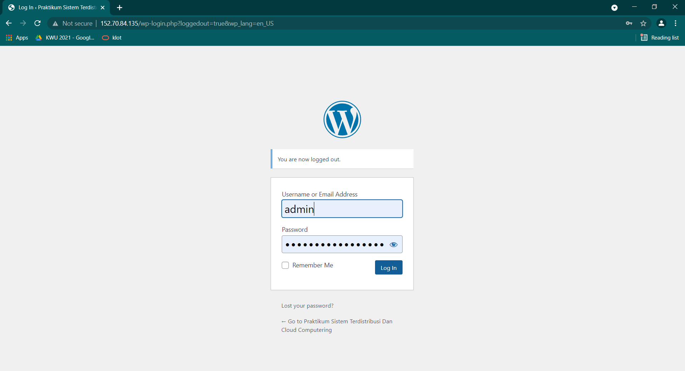
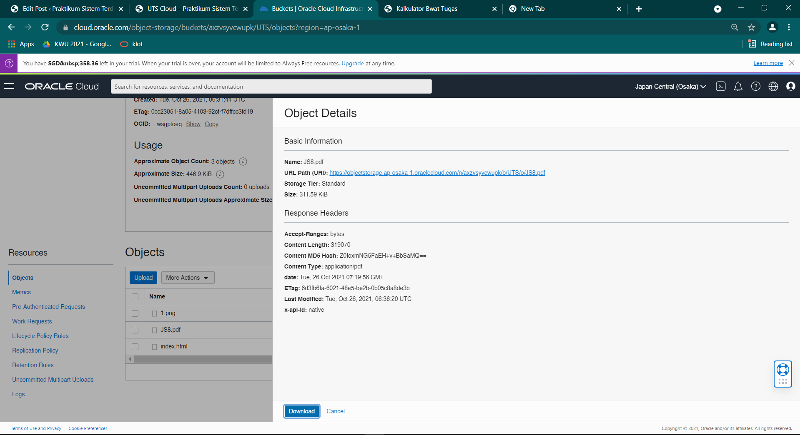
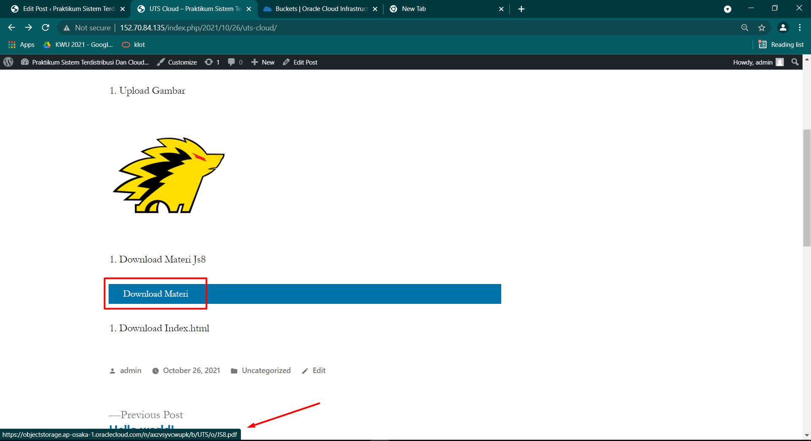

# 09 - UTS

## UTS Komputasi Awan

Untuk MK Komputasi Awan nanti tidak ada kelas daring & info dr Puskom portal/LMS sdg pemeliharaan server.
Agenda hari ini diganti UTS dg spesifikasi use case spt berikut:

Silakan masing-masing individu memanfaatkan object storage sebagai media penyimpanan assets (gambar, file2 upload, dsb) berdasarkan project Kuis 1 kemarin yaitu aplikasi Wordpress.
Sehingga hasil akhir utk UTS aplikasi dpt memanfaatkan VM, DB instance dan Object Storage.
Buatlah laporan di masing-masing repo private GitHub Anda!
Deadline 2 Nov 2021 Jam 07:00 WIB.

## Hasil UTS

1. Login ke halaman admin wordpress masing - masing.

2. Buat post baru

3. Buka oracle cloud lalu buatlah bucket object storage baru untuk menyimpan file. Atur visibilitas menjadi public

4. Upload file gambar, materi dan file index.html yang akan di tampilkan pada wordpress 

5. Kembali ke halaman editor post admin wordpress, masukkan link yang telah diupload.

# Insert gambar

lalu masukkan link nya

Setelah di publish maka hasilnya akan seperti ini :

# Insert File pdf untuk materi js 8
tambahkan embed 
 lalu tambahkan link 

edit tampilan nya kemudian publish atau update

maka hasilnya akan seperti dibawah ini

dan jika di klik maka akan muncul seperti ini

# Insert File Index.html
tambahkan embed kemudian masukan link 

kemudian edit tampilannya dan publish

setelah dipublis maka hasilnya akan seperti ini

ketika di klik "Lihat web" maka hasilnya seperti dibawah ini

Link Wordpress : http://152.70.84.135/index.php/2021/10/26/uts-cloud/
